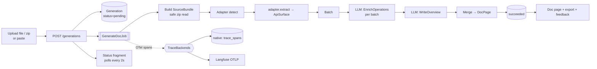

# Docs-to-UI: Architecture & Implementation Spec (v6)

> **Status:** Draft. **[Decided]** marks settled decisions; **[Default]** marks proposed defaults that stand unless changed. Unresolved items are in §17.

---

## 1. Overview

**Docs-to-UI** is a single-user, local developer tool. It accepts an OpenAPI document or Python source code, as a single file, pasted text, or a `.zip` archive. It produces an interactive, styled documentation page that can be viewed in the app or exported as a standalone HTML file.

| Part | Role | When it runs |
|---|---|---|
| **Web app** (Plain Framework) | Accepts input; runs generation jobs; renders, stores and exports doc pages; hosts the native trace viewer | Always (web process + job worker) |
| **Generation program** (DSPy + Gemini) | Writes structured documentation content for an API surface | Inside the job worker |
| **Optimization pipeline** (DSPy) | Tunes the generation program against a dataset and metric; emits a versioned program artifact | Offline, on demand |
| **Design system** ([OpenDesign](https://github.com/nexu-io/open-design)) | Defines the semantic CSS tokens every page uses | Design time |

**Tooling**

| Tool | Used for |
|---|---|
| `uv` | Dependencies |
| `ruff` | Lint and format (via Plain's tooling) |
| Pydantic | All structured data |
| Postgres | Persistence, job queue, native trace store |
| OpenTelemetry | Tracing |
| pytest, Playwright | Tests |
| GitHub Actions, Docker | CI |

Plain Framework conventions are followed wherever they apply (§14).

## 2. Goals and Non-Goals

**Goals**
- Turn an OpenAPI document or a Python codebase into a readable, navigable doc page.
- Make output quality measurable, and improvable through offline optimization.
- Trace every generation end to end — request → job → each LLM call — and view those traces either in the app or in Langfuse.
- Capture user feedback on generated pages as data the optimization pipeline can use.
- Keep adding a new source language a contained task (§7).

**Non-goals**
- Multi-user support, authentication, or sharing. The app binds to `127.0.0.1` only.
- Hosting generated docs. Export produces a file; hosting is the user's choice.
- Executing or importing the user's code. Python is parsed with `ast`; archives are read in memory and never extracted to disk.
- LLM-produced HTML, CSS, or JS.
- Managing prompts outside DSPy. Prompts are compiled program artifacts, not rows in a prompt registry.
- Mixed-language inputs. A generation uses exactly one adapter. A zip containing both Python code and an OpenAPI spec is documented with whichever adapter is detected or chosen, and the other files are listed as skipped in the manifest.

## 3. Key Decisions

| # | Decision | Status |
|---|---|---|
| D1 | The LLM produces **structured data** (Pydantic models), never markup. Templates and elements render everything. | **[Decided]** |
| D2 | Generation runs as a **background job** (`plain.jobs`); the UI polls job status over HTMX. | **[Decided]** |
| D3 | Structure is extracted **deterministically** wherever a parser exists: OpenAPI via a spec parser, Python via `ast`. The LLM writes descriptive content only. LLM extraction is a fallback for future languages without a parser. | **[Decided]** |
| D4 | Source languages plug in through a **`LanguageAdapter` registry**. v1 ships `openapi` and `python`. | **[Decided]** |
| D5 | Styling uses **CSS custom properties only**, taken from the OpenDesign package's `tokens.css`. No Tailwind. | **[Decided]** |
| D6 | **All instrumentation is OpenTelemetry.** Where traces go is a pluggable **`TraceBackend`**: `native` (Postgres + in-app viewer), `langfuse`, or both. Business code never imports a backend. | **[Decided]** |
| D7 | The default LLM is **Gemini 3.8 Flash** (`gemini/gemini-3.8-flash`), configurable by setting. | **[Decided]** (may change) |
| D8 | Maximum upload is **5 MB**. Large inputs are enriched in batches. | **[Decided]** |
| D9 | Every generated page can be **exported** as standalone HTML and as its JSON `DocPage`. | **[Decided]** |
| D10 | Layout follows **Plain conventions**: `app/settings.py`, `app/urls.py`, local packages under `app/<pkg>/`, elements in `templates/elements/`, settings overridable via `PLAIN_`-prefixed env vars. | **[Decided]** |
| D11 | **`.zip` archives are accepted.** Every input becomes a `SourceBundle` of one or more files; adapters only ever see bundles. | **[Decided]** |
| D12 | **Feedback is product data.** It is always stored natively and mirrored to Langfuse when that backend is active. | **[Default]** |
| D13 | DSPy signatures and Pydantic schemas are defined **once**, in `app/llm/`, which is importable without Plain. The optimization pipeline imports it. | **[Default]** |
| D14 | The optimized program is a **versioned file artifact** that the app loads at startup. | **[Default]** |
| D15 | Tests never call a real LLM. Evals, which do, are a separate, manually triggered workflow. | **[Default]** |

## 4. End-to-End Flow



**Stages**

1. **Ingest.** The view accepts a file, a `.zip`, or pasted text of at most 5 MB. It stores the raw bytes on a new `Generation`, enqueues the job, and returns the status fragment.
2. **Bundle.** The job turns the stored input into a `SourceBundle` (§8). Archives are read in memory under strict safety limits. The bundle manifest — which files were included, and which were skipped and why — is saved to `Generation.input_manifest`.
3. **Detect.** The adapter registry scores the bundle. The user can override the language in the form.
4. **Extract.** The chosen adapter produces an `ApiSurface`: operations, parameters, types, existing docstrings and spec descriptions, and source locations. No LLM prose is involved.
   - Invalid input fails with `input_error`, which carries the file path and line number.
5. **Batch.** Operations are grouped — by tag or path prefix for OpenAPI, by module or class for Python — and packed into batches under a token budget (§6.4).
6. **Enrich.** `EnrichOperations` runs once per batch. `WriteOverview` then runs once for the overview and the navigation groups.
7. **Merge and validate.** Unknown IDs returned by the LLM are dropped and recorded as span events.
8. **Persist, render, export, feedback.** The `DocPage` is stored on the `Generation`. The same templates render both the in-app page and the export. Feedback is attached to the generation and its trace.

## 5. Core Contracts

```python
# app/llm/schemas.py  (sketch)
from typing import Literal
from pydantic import BaseModel, Field

class SourceLocation(BaseModel):
    path: str                        # path inside the bundle, e.g. "src/acme/client.py"
    line: int

class Param(BaseModel):
    id: str                          # "GET /users/{id}#id" | "acme.client.Client.get#timeout"
    name: str
    location: Literal["path", "query", "header", "body", "arg", "kwarg"]
    type: str
    required: bool
    default: str | None = None
    source_description: str | None = None

class Operation(BaseModel):
    id: str
    kind: Literal["http", "function", "class", "method"]
    signature: str
    group_hint: str
    params: list[Param]
    returns: str | None = None
    source_description: str | None = None
    location: SourceLocation | None = None

class ApiSurface(BaseModel):
    title: str
    language: str
    operations: list[Operation]

class Example(BaseModel):
    title: str
    language: str
    code: str

class OperationDocs(BaseModel):
    operation_id: str
    summary: str = Field(max_length=200)
    description_md: str
    param_descriptions: dict[str, str]
    examples: list[Example]

class BatchEnrichment(BaseModel):
    operations: list[OperationDocs]

class Overview(BaseModel):
    overview_md: str
    groups: dict[str, list[str]]

class DocPage(BaseModel):
    schema_version: int = 1
    surface: ApiSurface
    overview: Overview
    operations: list[OperationDocs]
```

**Rules**
- IDs are deterministic functions of the input.
- `source_description` is passed to the LLM as context. The LLM may expand it but must not contradict it.
- All LLM text is untrusted.
  - Plain text is autoescaped.
  - `*_md` fields are rendered, then sanitized with `nh3`.
  - Example code is displayed, never run.
- `schema_version` is bumped on any breaking change.

`SourceBundle` is an ingestion type. It lives in `app/sources/`, not in the LLM schemas.

```python
class SourceFile(BaseModel):
    path: str                        # normalized, relative, "/"-separated
    text: str

class SourceBundle(BaseModel):
    files: list[SourceFile]
    origin: Literal["paste", "file", "zip"]
```

## 6. LLM Layer

### 6.1 Programs

| Program | Signature | Runs |
|---|---|---|
| `EnrichOperations` | `operations: list[Operation], api_title: str, language: str → result: BatchEnrichment` | Once per batch |
| `WriteOverview` | `surface_outline: str, batch_summaries: list[str] → result: Overview` | Once per generation |
| `ExtractApiSurface` | `source: str, language: str → surface: ApiSurface` | Only for adapters without a parser; unused in v1 |

- Programs use `dspy.Predict` or `dspy.ChainOfThought` with Pydantic-typed `OutputField`s. The deprecated `TypedPredictor` is not used.
- `app/llm/` has no Plain imports. Its configuration is passed in by the caller.
- Each batch gets one validation retry.
- **Partial failure:**
  - If ≤ 10% of batches fail, the page renders; those operations show source descriptions with a "not enriched" marker.
  - If more than 10% fail, the generation fails with `validation_error`.

### 6.2 Model Configuration

| Setting (env: `PLAIN_<NAME>`) | Default | Notes |
|---|---|---|
| `LLM_MODEL` | `gemini/gemini-3.8-flash` | LiteLLM string, as used by DSPy |
| `LLM_THINKING_LEVEL` | `medium` | `low`, `medium`, or `high` |
| `LLM_JUDGE_MODEL` | `gemini/gemini-3.8-flash` | Evals only |
| `LLM_JUDGE_THINKING_LEVEL` | `high` | |

- Uses `GEMINI_API_KEY`.
- Do not send `temperature`, `top_p`, or `top_k`; they are deprecated for current Gemini models.
- Introductory pricing ends December 31, 2026. Revisit cost assumptions then.
- `LLM_MODEL=fake` wires in `DummyLM` with fixture responses.

### 6.3 Program Artifacts

- Artifacts are written to `artifacts/programs/<program>/<version>.json`, next to a `.meta.json` recording the dataset hash, scores, model, thinking level, DSPy version, and date.
- `LLM_PROGRAM_VERSION` (default `baseline`) selects the artifact to load.
- Each `Generation` records `program_version` and `model`.
- CI runs a save → load → run round-trip against `DummyLM`.

### 6.4 Batching

| Setting | Default |
|---|---|
| `LLM_BATCH_TOKEN_BUDGET` | `60000` |
| `LLM_BATCH_MAX_OPERATIONS` | `25` |
| `LLM_MAX_CONCURRENCY` | `4` |

- Groups are kept whole where possible; oversized groups are split in order.
- Progress is written to `Generation.progress` as `{batches_done, batches_total}`.

## 7. Language Adapters

```python
# app/sources/adapters/base.py
class LanguageAdapter(Protocol):
    name: str                                  # "python", "openapi"
    display_name: str
    file_extensions: tuple[str, ...]
    default_excludes: tuple[str, ...]          # glob patterns skipped inside archives
    example_languages: tuple[str, ...]

    def includes(self, path: str) -> bool: ...            # file filter within a bundle
    def sniff(self, bundle: SourceBundle) -> float: ...    # 0.0–1.0 confidence
    def extract(self, bundle: SourceBundle) -> ApiSurface: ...   # raises InputError(path, line, msg)
    def group_key(self, op: Operation) -> str: ...
```

- **Registry:** `app/sources/registry.py`. `SOURCES_ENABLED_ADAPTERS` defaults to `["openapi", "python"]`.
- **Adding a language** means adding one adapter module, fixtures under `tests/fixtures/<name>/`, and a dataset folder under `dspy_pipeline/datasets/<name>/`.

**`openapi` adapter**
- Supports OpenAPI 3.0 and 3.1, in JSON or YAML.
- **Entry file:** for a single file, that file. For a zip, the shallowest file with a top-level `openapi:` key. If several qualify, the user must choose one.
- **`$ref`s:** relative refs resolve **within the bundle only**. Remote refs and refs that escape the bundle root are rejected.

**`python` adapter**
- Parses with `ast` only.
- Includes `*.py`.
- **Default excludes:** `**/tests/**`, `**/test_*.py`, `**/.venv/**`, `**/venv/**`, `**/__pycache__/**`, `**/build/**`, `**/dist/**`, `**/site-packages/**`.
- **Module paths:**
  1. Detect the package root: a `src/` layout if present; otherwise the shallowest directories containing `__init__.py`.
  2. Derive module paths from the file's position under that root.
  3. Directories without `__init__.py` under the root are treated as namespace packages.
- **What is extracted:** public module-level functions and classes, their public methods, signatures, annotations, defaults, and docstrings.
  - `__all__` is respected when present.
  - Names beginning with `_` are skipped.
  - Each operation records its `SourceLocation`.
- **Re-exports** **[Decided]:** when a package's `__init__.py` re-exports a name and lists it in `__all__` (for example `acme.Client`, defined in `acme/client.py`), the operation is documented once, under its **public path** (`acme.Client`).
  - Its `SourceLocation` still points to the definition site.
  - It is not duplicated under `acme.client`.
  - Re-exports not listed in `__all__` stay under their definition path.

**Adapter contract suite:** a parametrized test runs every registered adapter against its fixtures. It checks ID stability, file filtering, grouping, and error locations.

## 8. Input Handling and Zip Safety

Every input is normalized to a `SourceBundle` before any adapter runs.

| Origin | Bundle |
|---|---|
| Paste | One file, `input.<ext>`; the extension comes from the language picker |
| Single file | One file, keeping its filename |
| `.zip` | Every member that passes the safety checks and the adapter's `includes()` |

**Zip rules** (`app/sources/archive.py`):

| Rule | Limit (setting) |
|---|---|
| Upload size (compressed) | 5 MB (`GENERATIONS_MAX_INPUT_BYTES`) |
| Total uncompressed bytes read | 50 MB (`SOURCES_ZIP_MAX_UNCOMPRESSED_BYTES`) |
| Per-file uncompressed size | 5 MB (`SOURCES_ZIP_MAX_FILE_BYTES`) |
| Number of entries | 5,000 (`SOURCES_ZIP_MAX_ENTRIES`) |

- **In memory only.** Archives are read with `zipfile` from the stored bytes and never extracted to disk.
- **Byte counting.** Bytes are counted *while reading* each member rather than trusted from headers. Exceeding any limit aborts with `input_error`, which blocks zip bombs.
- **Path safety.** Paths are normalized to relative, `/`-separated form. Absolute paths, `..` segments, drive letters, and symlink entries are rejected.
- **Skipped entries.** Nested archives, binary files, and files that aren't valid UTF-8 are skipped and recorded in the manifest with the reason.
- **Common root.** A single top-level folder (the usual GitHub "Download ZIP" shape) is stripped.
- **Visibility.** The resulting manifest is shown on the generation page as "Files read (N included, M skipped)", so the user can see exactly what was documented.

## 9. Background Generation

```python
# app/generations/jobs.py
@register_job
class GenerateDocJob(Job):
    def __init__(self, generation_id: int): ...
    def default_concurrency_key(self): return f"generation-{self.generation_id}"
    def default_retries(self): return 0
    def run(self):
        # Exit if status != "pending".
        # Run bundle → detect → extract → batch → enrich → overview → merge,
        # updating stage/progress and checking the soft timeout between batches.
    def on_aborted(self, result):
        # status="failed", error_code="worker_lost"
```

**State machine**
```
pending ──► running ──► succeeded
   │           └──────► failed (input_error | validation_error | provider_error | timeout | worker_lost)
   └──────────────────► failed (enqueue_error)
```

- `GENERATIONS_TIMEOUT_S` defaults to `900`.
- **Regenerate** creates a new `Generation` from the stored input bytes.
- **Polling:**
  - The status fragment uses `hx-trigger="every 2s"`.
  - On success, the server responds with `HX-Redirect`.
  - On failure, it returns an error fragment with Retry, using HTTP 286 to stop polling.
- **Worker:** runs as `plain jobs worker`. In dev it runs alongside the server via `[tool.plain.dev.run]`.

## 10. Observability

### 10.1 Design

There are two layers, and the split between them is the whole design.

1. **Instrumentation** is always OpenTelemetry, and it is the same regardless of backend:
   - Plain's built-in spans for requests, database queries, and `plain.jobs` enqueue and execution (linked to the originating request);
   - `openinference-instrumentation-dspy` for DSPy module and LM calls;
   - the job's own stage spans (`bundle`, `extract`, `enrich.batch[n]`, `overview`, `merge`), carrying `docs.*` attributes;
   - `generation_id` and `program_version`, propagated to every span via OTel Baggage and a `BaggageSpanProcessor`.
2. **Destination** is a `TraceBackend`. It is selected by setting, and several can be active at once.

No view, job, or `app/llm` module imports a backend. The only callers are `app/telemetry/config.py` (at startup) and the feedback and trace-link helpers in `app/telemetry/api.py`.

### 10.2 Interface

```python
# app/telemetry/backends/base.py
from typing import Protocol
from opentelemetry.sdk.trace import SpanProcessor

class TraceBackend(Protocol):
    name: str

    def span_processor(self) -> SpanProcessor:
        """Processor added to the shared TracerProvider (always a BatchSpanProcessor)."""

    def trace_url(self, trace_id: str) -> str | None:
        """Where a human can view this trace."""

    def record_feedback(self, trace_id: str, feedback: "FeedbackEvent") -> None:
        """Mirror feedback to the backend. Must never raise."""

    def shutdown(self) -> None: ...
```

```python
# app/telemetry/config.py  (ready())
existing = trace.get_tracer_provider()
if isinstance(existing, sdk_trace.TracerProvider):
    provider = existing              # something already installed a real provider: attach to it
else:
    provider = sdk_trace.TracerProvider(
        resource=Resource.create({"service.name": settings.TELEMETRY_SERVICE_NAME})
    )
    trace.set_tracer_provider(provider)

provider.add_span_processor(BaggageSpanProcessor(ALLOW_DOCS_KEYS))
for backend in build_backends(settings.TELEMETRY_BACKENDS):   # factory keyed by name
    provider.add_span_processor(backend.span_processor())
DSPyInstrumentor().instrument()
```

**Provider rules** **[Decided]**

OpenTelemetry allows only one global tracer provider per process, and a second `set_tracer_provider()` call is ignored with only a log warning. To avoid silently losing all traces:

1. **Attach, don't replace.** At startup, `app.telemetry` reuses an existing SDK `TracerProvider` if one is present. It creates and registers its own only when none exists. Package order in `INSTALLED_PACKAGES` therefore cannot disconnect the backends. `app.telemetry` is still listed first among local packages, so spans created during startup are not dropped.
2. **Verify in tests.** An integration test boots the app with an in-memory exporter backend, performs one request that enqueues a job, runs the job, and asserts both of the following:
   - spans from the request, the job, and a DSPy call all arrived;
   - those spans share one trace ID.
   If the backends ever become disconnected, CI fails instead of the trace viewer going quietly empty.

```python
# app/telemetry/api.py  — the only surface business code uses
def trace_url(trace_id: str) -> str | None: ...        # first active backend with a URL
def record_feedback(generation, event) -> Feedback: ... # save natively, then mirror to each backend
```

### 10.3 Backends

| | `native` | `langfuse` |
|---|---|---|
| **Span export** | `PostgresSpanExporter` in a `BatchSpanProcessor` → `trace_spans` table | `OTLPSpanExporter` in a `BatchSpanProcessor` → `{LANGFUSE_BASE_URL}/api/public/otel`, Basic auth built from `LANGFUSE_PUBLIC_KEY:LANGFUSE_SECRET_KEY` |
| **Trace UI** | In-app viewer at `/traces/` (§10.4) | Langfuse UI; the link is `{LANGFUSE_BASE_URL}/project/{LANGFUSE_PROJECT_ID}/traces/{trace_id}` |
| **Feedback mirror** | No-op (already stored natively) | Langfuse SDK `create_score(trace_id=…, name="user_feedback", value=…, comment=…)`, sent in a background job |
| **Needs** | Postgres only | Langfuse project and keys |

**Selection:** `TELEMETRY_BACKENDS` is a list, for example `["native"]`, `["langfuse"]`, `["native", "langfuse"]`, or `[]`. Changing it takes effect on restart of both the web and worker processes.

**`PostgresSpanExporter` rules**
- It runs on the BatchSpanProcessor's background thread and writes with a **dedicated raw `psycopg` connection**, not the ORM.
  - This avoids sharing request-scoped connections across threads.
  - It also keeps its own inserts out of Plain's query instrumentation. Otherwise every export would produce new spans in a feedback loop.
- Batches are bulk-inserted in one statement.
- On any error, it drops the batch, logs a warning (at most once a minute), and returns `FAILURE`. **Export never affects a generation.**
- Individual attribute values are truncated to `TELEMETRY_NATIVE_MAX_ATTRIBUTE_BYTES` (default 256 KB) with a `…[truncated]` marker, so large batch prompts don't bloat the table.

### 10.4 Native Trace Viewer

This is a small Plain package, `app/traces/`, that renders stored spans using the same design tokens and elements as the rest of the app.

| Page | Contents |
|---|---|
| `/traces/` | Recent traces: root span name, duration, status, and `generation_id` link; filterable by generation and status |
| `/traces/<trace_id>/` | Waterfall timeline of the span tree, with durations as bars; errors highlighted |
| Span detail (HTMX panel) | Attributes and events. **LLM spans** get a dedicated view built from OpenInference attributes: model, input and output messages, and token counts (prompt, completion, total) |
| Generation page | Summary strip: total LLM calls, total tokens, wall time, plus a "View trace" link via `trace_url()` |

**Retention:** a scheduled job in `JOBS_SCHEDULE` prunes spans older than `TRACES_RETENTION_DAYS` (default 30) once a day.

### 10.5 Feedback

- On the generation page, the user can mark the whole page, or a single operation card, as 👍 or 👎, with an optional correction comment.
- `record_feedback()` saves a `Feedback` row, then mirrors it to each active backend.
- `dspy_pipeline/` can export 👎 feedback with comments as candidate dataset entries (`optimize.py export-feedback`). Candidates are reviewed by hand before being added to a dataset.

### 10.6 Why not a hand-written logging adapter

An earlier proposal used a single `ObservabilityProvider` protocol covering `get_prompt`, `log_trace`, and `add_feedback`, with native and Langfuse implementations. v6 keeps the good parts: a Protocol, a settings-keyed factory, and backend-agnostic business code. It changes three things:

- **No `get_prompt`.** Prompts are DSPy program artifacts (§6.3). A second prompt store would bypass optimization and create two sources of truth.
- **No manual `log_trace`.** Logging only the final input and output after the call loses the per-batch LLM calls, retries, token counts, latencies, and the request → job linkage. OTel instrumentation captures all of those automatically.
- **No per-call `flush()`.** It blocks the caller. Backends export on background threads instead.

## 11. Rendering, Design System, and Export

### 11.1 Design System (OpenDesign)

- `design/docs-to-ui/` is an OpenDesign design-system package containing `manifest.json`, `DESIGN.md`, and `tokens.css`. It is created from `DESIGN_BRIEF.md`.
  - `tokens.css` is the only design file the app consumes.
- `design/docs-to-ui/reference/` holds three HTML mockups (`doc-page.html`, `app-shell.html`, `trace-viewer.html`). They are the visual target for the elements in §11.2, and are never served by the app.
- **Source of truth.** The repo copy is authoritative.
  - The design package is produced in the OpenDesign app on Windows and copied into the repo through the WSL path (`\\wsl.localhost\<distro>\home\<user>\code\docs-to-ui\design\docs-to-ui\`).
  - To revise it, re-import that folder with OpenDesign's local-folder import, then copy the results back.
  - Coding agents never edit this folder (see `AGENTS.md` §0).
- **Token names [Decided].**
  - `tokens.css` declares every token in OpenDesign's shared token schema: surface, foreground, border, accent, semantic, fonts, type scale, leading and tracking, spacing, section rhythm, radius, elevation, focus, motion, and layout.
  - It also declares Docs-to-UI extensions prefixed `--d2u-`: `--d2u-info`, HTTP method colors, code and syntax colors, sidebar and header sizes, and trace span colors.
  - The full list is in `DESIGN_BRIEF.md` §6. Components reference only these names.
- **Themes [Decided].**
  - Light values go in `:root`.
  - Dark values override the same token names under `[data-theme="dark"]`, and under `@media (prefers-color-scheme: dark)` when no theme is set.
  - Exports follow the reader's system preference.
  - Component CSS contains no theme-specific rules.
- **Fonts [Decided].**
  - System font stacks by default, with no web-font CDNs, so exports make no network requests (§11.4).
  - If custom fonts are used, they ship as `.woff2` in `design/docs-to-ui/fonts/`. They are copied to app assets, and inlined as base64 `@font-face` rules in HTML exports.
- `scripts/sync_design.py`:
  1. validates the manifest;
  2. checks that every required token (the shared schema plus `--d2u-` extensions) is declared, including a dark-theme block;
  3. rejects `url()` values that point to the network;
  4. copies `tokens.css` (and any fonts) into `app/assets/`.
  CI fails if the copy is stale.
- Component CSS may use `var(--…)` tokens only. A test rejects raw color literals.

### 11.2 Elements

Elements live in `app/templates/elements/`.

| Namespace | Components |
|---|---|
| `doc.*` | `Layout`, `OperationCard` (includes the "not enriched" state and the source location), `ParamTable`, `CodeExamples`, `Prose`, `FeedbackButtons` (hidden in export) |
| App shell | `SourceForm` (file, zip or paste, with language override), `StatusFragment`, `ErrorFragment`, `FileManifest` |
| `traces.*` | `Waterfall`, `SpanDetail`, `LLMCallView` |

### 11.3 Interactivity Constraint

Doc-page interactivity (navigation, collapsing sections, example tabs, copy buttons) uses one vanilla JS file, `app/assets/js/docpage.js`, so that exports work without a server. HTMX is used only in the app shell and the trace viewer.

### 11.4 Export

| Route | Returns |
|---|---|
| `GET /generations/<id>/export.html` | Self-contained file: tokens, component CSS, and `docpage.js` inlined; no external requests, HTMX, app links, or feedback buttons |
| `GET /generations/<id>/export.json` | The raw `DocPage` |

## 12. Persistence

| Model | Package | Key fields |
|---|---|---|
| `Generation` | `generations` | `id`, `language`, `input_origin` (paste/file/zip), `input_filename`, `input_blob` (bytea, original bytes), `input_sha256`, `input_bytes`, `input_manifest` (JSON: included and skipped files with reasons), `status`, `stage`, `progress`, `program_version`, `model`, `doc_json`, `error_code`, `error_detail` (incl. path and line), `trace_id`, timestamps |
| `Feedback` | `generations` | `id`, `generation_id`, `operation_id` (nullable = whole page), `score` (+1/−1), `comment`, `trace_id`, `created_at` |
| `TraceSpan` | `traces` | `trace_id`, `span_id` (PK pair), `parent_span_id`, `name`, `kind`, `start_time`, `end_time`, `duration_ms`, `status_code`, `status_message`, `attributes` (JSONB), `events` (JSONB), `resource` (JSONB), `generation_id` (indexed, copied from baggage), `is_llm` (indexed) |

- All models use `plain.postgres`.
- `TraceSpan` rows are written only by the native exporter.

## 13. Optimization Pipeline

```
dspy_pipeline/
├── datasets/{openapi,python}/   # JSONL, train/dev split; include multi-file zips
├── metrics/{enrich,extract}.py
└── optimize.py                  # optimize | evaluate | export-feedback
```

**Metric for `EnrichOperations`**

| Component | What it checks | Weight |
|---|---|---|
| Schema validity | Output parses as `BatchEnrichment` | Hard gate: 0 if invalid |
| Coverage | Share of operation IDs that have docs | 0.25 |
| Fidelity | No references to params or operations absent from the surface | 0.25 |
| Consistency | Does not contradict `source_description` (judge model) | 0.15 |
| Example validity | JSON parses, Python `ast.parse`s, curl paths exist in the surface | 0.15 |
| Prose quality | Judge rubric score | 0.20 |

Evaluation runs send traces to whichever backends are configured, so eval runs are inspectable in the same UI as normal generations.

## 14. Repository Layout (Plain conventions)

```text
docs-to-ui/
├── .github/workflows/{ci.yml, evals.yml}
├── app/
│   ├── settings.py                 # INSTALLED_PACKAGES (app.telemetry first among local pkgs), JOBS_SCHEDULE
│   ├── urls.py
│   ├── templates/{base.html, export_base.html, elements/}
│   ├── assets/{css/tokens.css, css/components.css, js/docpage.js}
│   ├── telemetry/                  # Plain package
│   │   ├── config.py               # ready(): TracerProvider, backends, DSPy instrumentation
│   │   ├── api.py                  # trace_url(), record_feedback()
│   │   ├── default_settings.py     # TELEMETRY_*
│   │   └── backends/{base,native,langfuse}.py
│   ├── traces/                     # Plain package: native trace store + viewer
│   │   ├── models.py               # TraceSpan
│   │   ├── exporter.py             # PostgresSpanExporter
│   │   ├── views.py, urls.py
│   │   ├── jobs.py                 # PruneTracesJob
│   │   ├── default_settings.py     # TRACES_RETENTION_DAYS
│   │   └── templates/traces/
│   ├── generations/                # Plain package: product loop
│   │   ├── models.py               # Generation, Feedback
│   │   ├── views.py, urls.py, forms.py
│   │   ├── jobs.py                 # GenerateDocJob, MirrorFeedbackJob
│   │   ├── default_settings.py     # GENERATIONS_*, LLM_*
│   │   └── templates/generations/
│   ├── sources/                    # Plain package: bundles + adapters
│   │   ├── bundle.py               # SourceFile, SourceBundle
│   │   ├── archive.py              # safe zip reader
│   │   ├── registry.py
│   │   ├── default_settings.py     # SOURCES_*
│   │   └── adapters/{base,openapi,python}.py
│   └── llm/                        # plain Python, no Plain imports
│       ├── schemas.py, signatures.py, batching.py, generator.py
├── DESIGN_BRIEF.md                 # input for OpenDesign
├── design/docs-to-ui/{manifest.json, DESIGN.md, tokens.css, fonts/?, reference/}
├── artifacts/programs/
├── dspy_pipeline/
├── scripts/sync_design.py
├── tests/{fixtures/{openapi,python,zips}, unit, integration, e2e}
├── pyproject.toml                  # deps + groups, [tool.ruff], [tool.plain.dev.run]
├── .env.example
├── .gitattributes                  # * text=auto eol=lf (Linux/WSL-only development)
├── Dockerfile                      # base, test, prod
├── docker-compose.yml              # postgres
└── docker-compose.test.yml         # postgres, web, worker, playwright
```

**Development environment [Decided]**

| Where | What |
|---|---|
| WSL (Ubuntu), Linux filesystem | The repository (`~/code/docs-to-ui`), `git`, `gh`, `uv`, `plain`, the coding agent (OpenCode), tests, and `docker compose` |
| Windows | The browser (reaching the app through WSL localhost forwarding), Docker Desktop (WSL2 backend), and the OpenDesign app with its own Windows OpenCode |

- The repository never lives on a Windows drive (`/mnt/c/…`), and Windows Git clients are not used on it.
- The only thing that crosses from Windows into the repo is the design package (§11.1), which is copied in by hand.
- The full agent rules are in `AGENTS.md` §0.

**Plain conventions applied**
- Local packages are created with `plain create <name>`, listed in `INSTALLED_PACKAGES`, and use prefixed settings in `default_settings.py`.
- Installed Plain packages: `plain.postgres`, `plain.jobs`, `plain.htmx`, `plain.elements`, `plain.pytest`, `plain.code`, and `plain.toolbar` (dev).
- Schema changes go through `plain.postgres`' workflow, including `plain postgres sync`.

**Dependency groups**

| Group | Contents |
|---|---|
| default | App runtime, including `dspy`, `openinference-instrumentation-dspy`, OTel SDK and OTLP exporter, `psycopg`, `langfuse` (imported only when that backend is active), `nh3`, `pyyaml` |
| `optimize` | Pipeline-only tooling |
| `dev` | Playwright and test utilities |

## 15. Configuration Summary

| Variable | Default | Purpose |
|---|---|---|
| `DATABASE_URL` | required | Postgres connection |
| `GEMINI_API_KEY` | — | Gemini API authentication |
| `PLAIN_LLM_MODEL` | `gemini/gemini-3.8-flash` | Generation model, or `fake` |
| `PLAIN_LLM_THINKING_LEVEL` | `medium` | Thinking level for generation |
| `PLAIN_LLM_JUDGE_MODEL` | `gemini/gemini-3.8-flash` | Judge model for evals |
| `PLAIN_LLM_JUDGE_THINKING_LEVEL` | `high` | Thinking level for the judge |
| `PLAIN_LLM_PROGRAM_VERSION` | `baseline` | Which optimized artifact to load |
| `PLAIN_LLM_BATCH_TOKEN_BUDGET` | `60000` | Token budget per batch |
| `PLAIN_LLM_BATCH_MAX_OPERATIONS` | `25` | Operations per batch |
| `PLAIN_LLM_MAX_CONCURRENCY` | `4` | Parallel batch calls |
| `PLAIN_LLM_FAKE_RESPONSES` | `""` | DummyLM fixture file used when `LLM_MODEL=fake` (tests set it in `.env.test`) |
| `PLAIN_GENERATIONS_MAX_INPUT_BYTES` | `5242880` | Upload / paste cap |
| `PLAIN_GENERATIONS_TIMEOUT_S` | `900` | Soft timeout |
| `PLAIN_SOURCES_ENABLED_ADAPTERS` | `["openapi","python"]` | Enabled language adapters |
| `PLAIN_SOURCES_ZIP_MAX_UNCOMPRESSED_BYTES` | `52428800` | Zip total uncompressed limit |
| `PLAIN_SOURCES_ZIP_MAX_FILE_BYTES` | `5242880` | Zip per-file limit |
| `PLAIN_SOURCES_ZIP_MAX_ENTRIES` | `5000` | Zip entry limit |
| `PLAIN_TELEMETRY_BACKENDS` | `["native"]` | Active trace backends |
| `PLAIN_TELEMETRY_SERVICE_NAME` | `docs-to-ui` | Service name on traces |
| `PLAIN_TELEMETRY_NATIVE_MAX_ATTRIBUTE_BYTES` | `262144` | Native attribute truncation |
| `PLAIN_TRACES_RETENTION_DAYS` | `30` | Native trace retention |
| `LANGFUSE_BASE_URL`, `LANGFUSE_PUBLIC_KEY`, `LANGFUSE_SECRET_KEY`, `LANGFUSE_PROJECT_ID` | — | Required when `langfuse` is active; checked at startup. Stored as `TELEMETRY_LANGFUSE_*` settings, so `PLAIN_TELEMETRY_LANGFUSE_*` also works |

## 16. Testing and CI

| Layer | Scope | LLM | Runs |
|---|---|---|---|
| Unit | Schemas; adapter contract suite; **zip safety** (bomb, zip-slip, symlink, non-UTF-8, entry cap, root stripping); batching; merge; sanitizer; CSS token check; backend factory | None / `DummyLM` | Every push |
| Integration | `GenerateDocJob` through all states; spans asserted with an in-memory exporter; **telemetry wiring: request → job → DSPy spans arrive with one trace ID** (§10.2); **`PostgresSpanExporter` writes and truncates correctly and never raises**; feedback save + mirror (Langfuse client mocked) | `DummyLM` | Every push |
| E2E | Zip upload → poll → page → file manifest; failure → retry; export opened from disk; feedback click; trace viewer waterfall and LLM span view | `LLM_MODEL=fake`, worker running, `TELEMETRY_BACKENDS=["native"]` | Every push |
| Artifact round-trip | Save → load → run | `DummyLM` | Every push |
| Design sync | `tokens.css` copy matches `design/` | — | Every push |
| Evals | Full metric on dev sets | Gemini | Manual |

## 17. Open Questions

1. **Judge independence.** The judge shares the generation model. Consider a different Gemini tier once evals exist.
2. **Rate limits.** Confirm that `LLM_MAX_CONCURRENCY=4` fits your Gemini tier.

## 18. Milestones

| | Scope | Proves |
|---|---|---|
| **M1** | OpenAPI adapter (single file) → render → HTML/JSON export with no LLM; OpenDesign sync; E2E harness | Contracts, tokens, export |
| **M2** | Enrichment + batching + `GenerateDocJob` + polling; OTel instrumentation; **`native` backend + trace viewer** | Core loop, traces |
| **M3** | `SourceBundle` + safe zip reader; Python adapter; OpenAPI multi-file `$ref`s; adapter contract suite | Codebases as input |
| **M4** | Feedback; datasets, metrics, `optimize.py`, first promoted artifact, `evals.yml` | Measurable quality |
| **M5** | `langfuse` backend + feedback mirroring; polish | Backend choice |

## 19. Changelog

**v6.3**
- Recorded the development environment: the repository and all tooling in WSL, with the browser, Docker Desktop and OpenDesign on Windows.
- The design package crosses from Windows to the repo by hand-copy through the WSL path, and coding agents never edit it.
- `.gitattributes` enforces LF line endings.

**v6.2**
- Added `DESIGN_BRIEF.md` as the OpenDesign input.
- Decided token names (OpenDesign shared schema plus `--d2u-` extensions), light and dark themes, and offline fonts.
- Added reference mockups in `design/docs-to-ui/reference/`.
- Expanded the sync script checks.

**v6.1**
- Decided that Python re-exports listed in `__all__` are documented under their public path.
- Made mixed-language zips a non-goal.
- Replaced the provider-ordering open question with two rules: attach to an existing tracer provider rather than replace it, and an integration test for the telemetry wiring.

**v6**
- Added `.zip` input via `SourceBundle`, with in-memory safe reading, limits, file filtering, and a visible manifest.
- Added Python package-root detection and source locations.
- Replaced the single OTLP destination with a pluggable `TraceBackend` (`native`, `langfuse`, or both).
- Added a native Postgres span exporter and an in-app trace viewer with LLM call views.
- Added feedback as product data, mirrored to Langfuse.
- Documented why prompt fetching and manual trace logging are excluded.

**v5**
- Pinned OpenDesign; CSS variables only; Python-first with the adapter registry; export; OpenTelemetry; Gemini 3.8 Flash; 5 MB cap and batching; Plain package layout.

**v4**
- Recorded the core decisions; added flow, schemas, job, persistence, testing, and milestones.

**v3**
- Initial overview.
