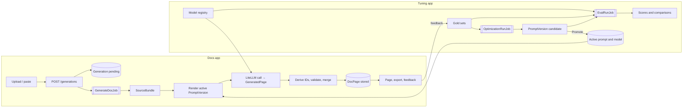

# Docs-to-UI: Architecture & Implementation Spec (v7)

> **Status:** Accepted for implementation (branch `redesign/v7`). **[Decided]** marks settled decisions; **[Default]** marks proposed defaults that stand unless changed. §19 records the questions resolved in review.
>
> v7 replaces v6's single app, where DSPy ran inside the web app. The web app now calls the LLM directly, and a second app does evaluation and tuning with DSPy. What changed from v6 is summarized in §21.

---

## 1. Overview

**Docs-to-UI** is a single-user, local developer tool made of two Plain apps that share one Postgres database.

| App | Role | Uses DSPy? |
|---|---|---|
| **Docs app** (`docs_app/`) | Accepts an OpenAPI document or Python source (a file, pasted text or a `.zip`), sends it to an LLM in one direct call, and renders the resulting documentation page. The page can be viewed in the app or exported as standalone HTML. | No |
| **Tuning app** (`tuning_app/`) | Evaluates and tunes the Docs app. Manages models, gold-set datasets, eval runs and DSPy optimization runs through a web UI, and promotes tuned prompts and models to the Docs app. | Yes |

Both apps share:
- the Pydantic contracts
- the source parsers
- the generation code
- the design system and its elements
- tracing and the trace viewer

This shared code lives in one library, `d2u`, so the Tuning app evaluates exactly the code path the Docs app runs in production.

> **Future option.** The two apps may later merge into one app with a "Tuning" section. The shared library and shared database are designed so that change is mostly a matter of routing and packaging. See §19.

**Tooling**

| Tool | Used for |
|---|---|
| `uv` (workspace) | Dependencies for the shared library and both apps |
| LiteLLM | Every LLM call, for any provider (Gemini, Claude, and others) |
| DSPy | Prompt optimization, in the Tuning app only |
| Pydantic | All structured data, including every LLM output |
| Postgres | Persistence, job queues, native trace store (shared by both apps) |
| OpenTelemetry | Tracing, to the native store and/or Langfuse, selectable in the UI |
| pytest, Playwright | Tests |
| GitHub Actions, Docker | CI |

## 2. Goals and Non-Goals

**Goals**
- Turn an OpenAPI document or a Python codebase into a readable, navigable doc page with one direct LLM call.
- Let the user choose the Docs app's model and add new models without code changes.
- Make output quality measurable, and at a minimum measure faithfulness and component accuracy against curated gold sets.
- Improve prompts offline with DSPy, compare them in a UI, and promote the best version to the Docs app.
- Keep deterministic parsing as a comparison baseline and a possible future generation strategy.
- Trace every generation and eval end to end, viewable in the app or in Langfuse. The user picks which.
- Capture user feedback as data for gold-set curation.

**Non-goals**
- Multi-user support, authentication or sharing. Both apps bind to `127.0.0.1` only (the production container exception is in `AGENTS.md` §0).
- Hosting generated docs. Export produces a file; hosting is the user's choice.
- Executing or importing the user's code. Python is parsed with `ast`; archives are read in memory and never extracted to disk.
- LLM-produced HTML, CSS or JS. The LLM returns Pydantic types; templates render them.
- DSPy in the Docs app. Tuned prompts reach the Docs app as plain text and example pairs, not as DSPy programs.
- Mixed-language inputs. A generation documents one language; other files are listed as skipped.

## 3. Key Decisions

| # | Decision | Status |
|---|---|---|
| D1 | Every LLM output is a **Pydantic model**, requested through the provider's structured-output support and validated with `model_validate`. Templates render it. The LLM never produces markup. | **[Decided]** |
| D2 | Generation runs as a **background job** (`plain.jobs`); the UI polls over HTMX. Evals and optimization runs are background jobs in the Tuning app. | **[Decided]** |
| D3 | The Docs app's default strategy is **`llm`**: the LLM reads the source and produces the page's full content, structure included. The deterministic parsers are kept for the **`parser`** and **`hybrid`** strategies (§6.3), used as eval comparisons and as a possible future option. | **[Decided]** |
| D4 | Operation and parameter **IDs are derived in code** from what the LLM returns (method and path, or qualified name), never invented by the LLM. | **[Decided]** |
| D5 | Styling uses **CSS custom properties only**, from the OpenDesign `tokens.css`. No Tailwind. | **[Decided]** |
| D6 | **All instrumentation is OpenTelemetry.** The trace destination (native, Langfuse, both or none) is **chosen by the user in the UI** and takes effect without a restart (§11). | **[Decided]** |
| D7 | **Every LLM call goes through LiteLLM.** Models are rows in a shared **model registry** managed in the Tuning app's UI (§7). | **[Decided]** |
| D8 | Maximum input is **1 MB** (compressed upload or pasted text). Inputs too large for one call are split and merged (§6.4). | **[Decided]** |
| D9 | Every generated page can be **exported** as standalone HTML and as its `DocPage` JSON. | **[Decided]** |
| D10 | **Two Plain apps share one database.** Shared code and shared tables live in the `d2u` library (§15). | **[Decided]** |
| D11 | `.zip` archives are accepted. Every input becomes a `SourceBundle`. | **[Decided]** |
| D12 | **Tuned prompts are data.** A `PromptVersion` (instructions plus few-shot examples) is produced in the Tuning app and rendered by the Docs app into a direct LiteLLM call. Promotion is a button in the Tuning app. | **[Decided]** |
| D13 | **Evals always run the production code path** (`d2u.generation`). DSPy only searches for better instructions and examples; every reported score comes from the production path. | **[Decided]** |
| D14 | **Faithfulness and component accuracy** are required metrics, measured against **gold sets** curated in the Tuning app's UI (§9). | **[Decided]** |
| D15 | Tests never call a real LLM. Real-model evals run only when the user starts them. | **[Default]** |
| D16 | The eval **judge model** is chosen per run and should differ from the generation model. The seeded default judge is a Claude model, a different provider from the seeded Gemini generation model. The UI warns when judge and generation model are the same. | **[Decided]** |
| D17 | API keys are **never stored in the database**. A registered model names the environment variable that holds its key. | **[Default]** |

## 4. End-to-End Flow



**Docs app stages**
1. **Ingest.** Accept a file, `.zip` or pasted text of at most 1 MB. Store the raw bytes on a new `Generation`, enqueue the job and redirect to the generation page, which polls for status.
2. **Bundle.** Build a `SourceBundle` under the zip safety rules (§10) and save the manifest.
3. **Detect.** Choose the language: detected, or overridden in the form.
4. **Generate.** Render the active `PromptVersion` for that language with the bundle's files. Call the chosen model through LiteLLM, requesting `GeneratedPage` as structured output. Split large inputs (§6.4).
5. **Validate and derive.** Validate into Pydantic, derive IDs in code, drop source locations that don't exist in the bundle, and convert to a `DocPage`.

Before step 4, the `llm` strategy runs the adapter's syntax check (`check_syntax`): OpenAPI documents are parsed and their version checked, and Python files are parsed with `ast`. Broken input fails with `input_error` and a file and line, without a model call. No structure is extracted. For OpenAPI, the call also names the entry file (the chosen one, or the only candidate; several candidates with none chosen is an `input_error`), and the prompt documents only that API.
6. **Persist, render, export, feedback.** As in v6.

## 5. Core Contracts

All contracts live in `d2u.schemas` (Plain-free).

```python
# d2u/schemas/generated.py — what the LLM returns (strategy "llm")
class GeneratedParam(BaseModel):
    name: str
    location: Literal["path", "query", "header", "body", "arg", "kwarg"]
    type: str
    required: bool
    default: str | None = None
    description: str

class GeneratedOperation(BaseModel):
    kind: Literal["http", "function", "class", "method"]
    method: str | None = None          # HTTP only, e.g. "GET"
    path: str | None = None            # HTTP only, e.g. "/pets/{id}"
    qualified_name: str | None = None  # Python only, e.g. "acme.Client.get"
    signature: str
    group: str
    summary: str = Field(max_length=200)
    description_md: str
    params: list[GeneratedParam]
    returns: str | None = None
    examples: list[Example]
    source_path: str | None = None
    source_line: int | None = None

class GeneratedPage(BaseModel):
    title: str
    overview_md: str
    operations: list[GeneratedOperation]
```

```python
# d2u/schemas/docpage.py — what is stored and rendered (every strategy)
# SourceLocation, Param, Operation, ApiSurface, Example, OperationDocs,
# Overview are unchanged from v6. DocPage gains the strategy and prompt used.
class DocPage(BaseModel):
    schema_version: int = 2
    strategy: Literal["llm", "hybrid", "parser"]
    surface: ApiSurface
    overview: Overview
    operations: list[OperationDocs]
```

**Rules**
- **IDs [Decided].** Operation IDs are `"{METHOD} {path}"` for HTTP and the qualified name for Python. Parameter IDs are `"{operation_id}#{name}"`. They are the same whether the structure came from the LLM or a parser, so gold sets, feedback and comparisons line up. Collisions get a deterministic suffix, and each one is recorded as a span event.
- **Validation.** An LLM response that fails validation is retried once, with the validation error included in the retry. A second failure fails the generation with `validation_error`.
- **Source locations.** A `source_path` that isn't in the bundle, or a `source_line` beyond the end of the file, is dropped rather than shown.
- **Untrusted text.** Plain text is autoescaped, `*_md` fields are rendered then sanitized with `nh3`, and example code is displayed, never run.
- **Storage [Default].** A `DocPage` is stored with `model_dump(mode="json")` in a JSONB column and always read back with `DocPage.model_validate`. Code only ever handles the Pydantic types.
- `schema_version` is bumped on any breaking change. v6 pages (`schema_version` 1) are read with `strategy="hybrid"`.

## 6. Generation (Docs app, `d2u.generation`)

`d2u.generation` is Plain-free. It receives configuration (model, prompt, limits) as arguments, so the Tuning app can call the same code.

### 6.1 The direct call

- Messages are built from a `PromptVersion` (§8):
  1. the system message holds its instructions;
  2. each of its few-shot examples becomes a user message followed by an assistant message;
  3. the final user message holds the bundle's files, each labeled with its path.
- The call is `litellm.completion(model=…, messages=…, response_format=GeneratedPage, **params)`. `params` comes from the model's registry entry (§7).
- The response is validated with `GeneratedPage.model_validate_json`.
- Token counts, cost (from LiteLLM) and latency are recorded on the generation and on its span.

### 6.2 From `GeneratedPage` to `DocPage` (pure)

1. Derive operation and parameter IDs (§5), resolve collisions and drop invalid source locations.
2. Build the `ApiSurface` from the structural fields: signature, parameters without descriptions, returns, location. Build the `OperationDocs` from the prose fields: summary, description, parameter descriptions, examples.
3. Build the `Overview` from `overview_md`, with groups taken from each operation's `group`, in first-seen order.

### 6.3 Strategies

| Strategy | Structure from | Prose from | Where it's available |
|---|---|---|---|
| `llm` | LLM | LLM (the same call) | Docs app default; Tuning app evals |
| `hybrid` | Deterministic parser (v6 adapters) | LLM, in one direct call per batch that returns `OperationDocs` for the given operations (no DSPy). Navigation groups follow the parser's group hints. | Tuning app evals; Docs app only when `GENERATIONS_ENABLE_HYBRID` is on |
| `parser` | Deterministic parser | Source descriptions only (no LLM) | Tuning app evals, as the structural baseline |

The v6 OpenAPI and Python adapters, the adapter registry and the adapter contract suite are kept unchanged in `d2u.sources`.

### 6.4 Input size and splitting

- The input cap is **1 MB** (`GENERATIONS_MAX_INPUT_BYTES = 1048576`).
- If the estimated prompt tokens are within the model's `max_input_tokens` (from the registry), the page is generated in **one call**.
- Otherwise the bundle is split into parts that each fit, keeping files from the same directory together, and each part is generated in its own call (up to `GENERATIONS_MAX_CONCURRENCY` in parallel).
  - Parts are merged in code: operations are unioned by derived ID (the first occurrence wins, and duplicates become span events), and groups keep their first-seen order.
  - One further call writes the overview from all parts' summaries. The overview call (also used by `hybrid`) uses a fixed prompt, `d2u/prompts/overview.md`; it is not a prompt version.
  - If any part fails, the generation fails. Partial pages are not produced for the `llm` strategy.

### 6.5 Model and prompt selection [Decided]

- The Docs app always uses the **active model** and the **active prompt version** for the input's language. Both are chosen only in the Tuning app. The Docs app has no model picker; it shows the active model and prompt version read-only on the generation form.
- The generation records the model, the prompt version and the strategy it used.

### 6.6 Background job

`GenerateDocJob` keeps v6's behavior:
- It claims the generation with a single `pending → running` update, so it's idempotent.
- It runs stage spans.
- It checks the soft timeout between calls.
- `on_aborted` records `worker_lost`.
- Failures map to `input_error`, `validation_error`, `provider_error`, `timeout` and `worker_lost`, plus `internal_error`, which v7 adds for unexpected exceptions.

## 7. Model Registry (shared, managed in the Tuning app)

| Field | Meaning |
|---|---|
| `name` | Display name, unique |
| `litellm_model` | LiteLLM model string, e.g. `gemini/gemini-3.8-flash` or `anthropic/claude-sonnet-4-5` |
| `api_key_env` | Name of the environment variable holding the key (e.g. `GEMINI_API_KEY`). The key itself is never stored (D17). |
| `api_base` | Optional base URL (for proxies or local models) |
| `params` | JSON object of call parameters, e.g. `{"reasoning_effort": "medium", "max_tokens": 32000}` |
| `max_input_tokens` | Input budget used for splitting (§6.4) |
| `enabled_for_generation`, `enabled_for_judging` | Which roles may use the model |
| `notes` | Free text |

- **Adding a model** is a form in the Tuning app. It offers only the parameters LiteLLM reports as supported for that model (`litellm.get_supported_openai_params`). Gemini 3 models never offer `temperature`, `top_p` or `top_k`.
- **Test connection** makes a minimal structured-output call and shows the result, latency and any error.
- **Activate for the Docs app** sets the active generation model (stored in `RuntimeSettings`). Only the Tuning app can change it.
- The fake model (`litellm_model = "fake"`) answers from fixture files, and is used only by tests.
- A seed migration adds two models:
  - `Gemini 3.8 Flash` (`gemini/gemini-3.8-flash`, reading `GEMINI_API_KEY`), the active generation model;
  - `Claude Sonnet` (`anthropic/claude-sonnet-4-5`, reading `ANTHROPIC_API_KEY`), the default judge.
  Both entries can be edited in the UI; the model strings are checked with **Test connection** when first used.
- Costs are reported per generation and per run. There are no spending caps.

## 8. Prompt Versions (shared)

| Field | Meaning |
|---|---|
| `language` | `openapi` or `python` |
| `strategy` | `llm` or `hybrid` |
| `version` | Unique label per language and strategy, e.g. `baseline`, `v3` |
| `instructions` | The system prompt text |
| `examples` | A list of few-shot pairs `{input_files, output: GeneratedPage}`, validated by Pydantic |
| `status` | `draft`, `candidate` or `active`. Exactly one is `active` per language and strategy. |
| `source` | `manual`, `optimization:<run id>` or `imported` |
| `scores` | The dev-set scores that justified promotion, copied from its eval run |
| `created_at`, `promoted_at` | |

- `baseline` versions are seeded from files in `d2u/prompts/`.
- The Tuning app can create a version by hand (editing instructions and examples in the UI), by optimization (§9.4), or by importing a JSON file.
- **Promote** makes a version active. The previous active version becomes a candidate. Every promotion is recorded, so a promotion can be rolled back with one click.

## 9. Tuning App

A Plain app with its own web server, job worker and UI. It shares the database, the design system and the trace viewer with the Docs app.

All Tuning app routes live under `/tuning/` (for example `/tuning/evals/12`), and its trace viewer is at `/tuning/traces`. Nothing in the Docs app's route space is reused, so a later merge into one app needs no URL changes (§19).

### 9.1 UI sections

| Section | Contents |
|---|---|
| **Dashboard** | Active model and prompt versions, the latest eval scores per language, recent runs |
| **Models** | Registry list, add, edit, test connection, activate for the Docs app, enable for judging |
| **Prompts** | Versions per language and strategy, a diff between versions, edit a draft, promote, roll back |
| **Gold sets** | Create, import, seed, edit, approve and split examples (§9.2) |
| **Evals** | Configure and start eval runs; results, per-example detail and run comparison (§9.3) |
| **Optimization** | Configure and start DSPy optimization runs; resulting candidates (§9.4) |
| **Metrics** | Metric definitions and weights, editable, with history (§9.5) |
| **Settings** | Trace backend selection (§11) and the default judge model. These are the only place runtime settings are changed. |
| **Traces** | The shared trace viewer (§11.4) |

### 9.2 Gold sets

A **gold set** is a named collection of **gold examples** for one language.

| Gold example field | Meaning |
|---|---|
| `input` | The source files as the app would receive them (origin, files, entry file) |
| `expected` | The reference `DocPage` structure and prose, a Pydantic model edited in the UI |
| `split` | `train`, `dev` or `test` |
| `status` | `draft` or `approved`. Only approved examples are used by runs. |
| `source` | `manual`, `parser_seed`, `generation:<id>` or `feedback:<id>` |
| `notes` | Reviewer notes |

**Creating examples**
- Paste or upload source, then choose how to fill the expected page:
  - start empty;
  - **seed from the parser** (the `parser` strategy);
  - **seed from a model** (the `llm` strategy with a chosen model).
- **Import a Docs app generation** (its input and output) as a draft.
- **Import from feedback.** 👎 feedback with a correction becomes a draft that keeps the correction as a note.

**Curating examples**
- A form editor for the expected page: operations, parameters, types, required flags, defaults, summaries, descriptions and examples. Every save is validated by Pydantic.
- Review states, per-example history and bulk split assignment.
- A gold set's content hash is recorded on every run that uses it.

### 9.3 Eval runs

An **eval run** takes:
- a gold set and split
- a strategy
- a generation model
- a prompt version (for `llm` and `hybrid`)
- a judge model
- the metric weights
- a concurrency limit

`EvalRunJob` then:
1. runs the production path (`d2u.generation`) on every approved example;
2. scores each output (§9.5);
3. stores per-example outputs, component scores, tokens, cost and latency.

**Results UI**
- Run summary: the mean of every metric and component, with confidence intervals across examples, plus total cost and latency.
- Per-example detail: the expected and generated pages side by side, with component-level differences highlighted (missing, invented and wrong fields), judge rationales and the trace link.
- **Compare runs.** Choose two or more runs on the same gold set to see per-metric deltas, which examples got better or worse, and strategy comparisons (for example `llm` against `parser` on component accuracy).

### 9.4 Optimization runs

An **optimization run** takes:
- a language
- a base prompt version
- a gold set, using its train split for search and its dev split for scoring
- a task model and a judge model
- an optimizer with its parameters

| Optimizer | Editable parameters (defaults) |
|---|---|
| `BootstrapFewShot` | max bootstrapped demos (4), max labeled demos (4), max rounds (1), metric threshold (0.7) |
| `BootstrapFewShotWithRandomSearch` | the above plus number of candidate programs (8) |
| `MIPROv2` | auto level (light, medium or heavy), max bootstrapped and labeled demos, number of trials, minibatch size, seed |
| `COPRO` | breadth (10), depth (3), initial temperature where the model supports it |

`OptimizationRunJob`:
1. wraps the base prompt's instructions and examples in a DSPy module whose signature mirrors `GeneratedPage`;
2. runs the chosen optimizer, with the configured metric as its objective;
3. exports the best program's instructions and demos as a new `PromptVersion` with status `candidate`;
4. starts an eval run of that candidate on the dev split, through the production path (D13).

The run page shows progress, the optimizer's trial log, the candidate's diff against its base, and its eval scores. A **Promote** button promotes the candidate.

### 9.5 Metrics

| Metric | How it's measured | Default weight |
|---|---|---|
| **Schema validity** | The output validates as `GeneratedPage` / `DocPage` | Gate: 0 if invalid |
| **Faithfulness** (required) | Share of claims in the output supported by the source. It combines deterministic checks (no invented operations, parameters or types relative to the gold page and, where available, the parser) with a judge that checks each description against the source and returns per-claim verdicts. | 0.30 |
| **Component accuracy** (required) | Field-level agreement with the gold page: operation set (precision, recall and F1 by derived ID), and for matched operations the accuracy of parameter names, locations, types, required flags and defaults, returns, signatures and groups. Reported per component and as a weighted mean. | 0.30 |
| **Coverage** | Share of gold operations present | 0.10 |
| **Example validity** | JSON parses, Python `ast.parse`s, curl paths exist in the gold surface | 0.10 |
| **Prose quality** | Judge rubric, 1–5 | 0.20 |
| Tokens, cost, latency | Reported, not scored | — |

- Weights and the component weights inside component accuracy are editable in the Metrics section. A change creates a new metric version, which is recorded on every run.
- Metric code lives in `tuning_app` (Plain-free modules). It reuses v6's pure metric functions where they still apply.

## 10. Input Handling and Zip Safety

Unchanged from v6, except for the lower size cap:

| Rule | Limit (setting) |
|---|---|
| Upload or paste size | 1 MB (`GENERATIONS_MAX_INPUT_BYTES`) |
| Total uncompressed bytes read | 50 MB (`SOURCES_ZIP_MAX_UNCOMPRESSED_BYTES`) |
| Per-file uncompressed size | 5 MB (`SOURCES_ZIP_MAX_FILE_BYTES`) |
| Number of entries | 5,000 (`SOURCES_ZIP_MAX_ENTRIES`) |

- Archives are read in memory, and bytes are counted while reading.
- Absolute paths, `..`, drive letters and symlinks reject the archive.
- Nested archives, binary files and non-UTF-8 files are skipped with a reason.
- A single top-level folder is stripped, and the manifest is shown.
- For the `llm` strategy, the adapter's `includes()` and default excludes still decide which files are sent to the LLM. This keeps tests, virtualenvs and build output out of the prompt.

## 11. Observability

### 11.1 Instrumentation

Unchanged from v6, in both apps:
- Plain's request, database and job spans
- OpenInference spans (`openinference-instrumentation-litellm` in both apps, plus `openinference-instrumentation-dspy` in the Tuning app)
- stage spans
- `docs.*` baggage (generation ID, eval run ID, prompt version, model)
- a job's root span continues its request's trace

### 11.2 Selecting the backend in the UI [Decided]

- `RuntimeSettings.trace_backends` is a subset of `{native, langfuse}`. It is edited only on the Tuning app's **Settings** page and applies to both apps. The Docs app shows the current selection read-only.
- At startup each process attaches a processor for every backend that *could* be used. `native` is always available. `langfuse` is available when its credentials are set in the environment.
- A **routing processor** forwards each finished span only to the currently selected backends. It reads the selection from the database, caching it for at most `TELEMETRY_SETTINGS_TTL_S` seconds (default 10), so changes apply without a restart.
- Langfuse can't be selected while its credentials are missing. The Settings page says which variables to set.
- `TELEMETRY_EXPORT_ENABLED` set to false attaches no backend processors at all, whatever is selected. The test suites and the image build use this, so no test exports spans unless it sets that up itself.
- Feedback is always stored natively, and is mirrored to Langfuse when it is selected (as in v6).

### 11.3 Backends

Unchanged from v6:

| Backend | How it works |
|---|---|
| `native` | Raw-psycopg exporter to `trace_spans`, never raises, attributes truncated |
| `langfuse` | OTLP with Basic auth; scores sent from a background job; the client uses a private tracer provider so spans aren't sent twice |

### 11.4 Trace viewer

The v6 viewer moves to the shared `d2u.traces` package, mounted at `/traces` in the Docs app and `/tuning/traces` in the Tuning app. Eval-run spans carry `docs.eval_run_id`, and the viewer can filter by it.

## 12. Rendering, Design System and Export

Unchanged from v6, except for where things live:
- The generated `tokens.css`, `components.css`, `docpage.js` and all shared elements (`doc.*`, `traces.*`, the app-shell components) move into the shared Plain package `d2u.ui`.
- Each app keeps only its own page templates and app-specific elements.
- `scripts/sync_design.py` now writes to `shared/src/d2u/ui/assets/css/tokens.css`.

## 13. Persistence

| Model | Package | Key fields |
|---|---|---|
| `Generation` | `d2u.generations` | v6 fields, plus `strategy`, `llm_model` (FK to `ModelConfig`), `prompt_version` (FK), `model` and `prompt_label` (the names at the time, kept if a registry entry changes), `input_tokens`, `output_tokens`, `cost_usd`, `latency_ms`. Drops `program_version`. |
| `Feedback` | `d2u.generations` | unchanged |
| `ModelConfig` | `d2u.registry` | §7 |
| `PromptVersion`, `PromptPromotion` | `d2u.registry` | §8 |
| `RuntimeSettings` | `d2u.registry` | singleton: `active_model_id`, `trace_backends`, `default_judge_model_id` |
| `TraceSpan` | `d2u.traces` | v6, plus an indexed `eval_run_id` |
| `GoldSet`, `GoldExample`, `GoldExampleRevision` | `tuning_app` (`app.goldsets`) | §9.2 |
| `EvalRun`, `EvalResult` | `tuning_app` (`app.evals`) | §9.3 |
| `OptimizationRun` | `tuning_app` (`app.optimization`) | §9.4 |
| `MetricVersion` | `tuning_app` (`app.evals`) | §9.5 |

- Shared models are defined once, in `d2u` Plain packages, and installed by both apps. Tuning-only models are installed only by the Tuning app.
- Either app can run `plain postgres sync`. Migrations for shared packages are identical in both.
- Existing v6 data migrates forward: pages keep rendering (§5). `program_version` is dropped along with the v6 program artifacts.

## 14. Jobs and Workers

| App | Worker command | Jobs |
|---|---|---|
| Docs app | `plain jobs worker` (queue `docs`) | `GenerateDocJob`, `MirrorFeedbackJob`, `PruneTracesJob` (scheduled) |
| Tuning app | `plain jobs worker` (queue `tuning`) | `EvalRunJob`, `OptimizationRunJob`, `TestModelJob` |

Queues are separate so each app's worker runs only its own jobs, even though both share the job tables.

## 15. Repository Layout

```text
docs-to-ui/
├── pyproject.toml                  # uv workspace root: members, shared dev tooling
├── uv.lock
├── shared/                         # the d2u library (workspace member)
│   ├── pyproject.toml              # litellm, pydantic, nh3, pyyaml, markdown-it-py, OTel, psycopg; no DSPy
│   └── src/d2u/
│       ├── schemas/                # Plain-free: GeneratedPage, DocPage, ...
│       ├── sources/                # Plain-free: bundles, safe zip reader, adapters, registry
│       ├── generation/             # Plain-free: prompt rendering, LiteLLM call, splitting, IDs, strategies
│       ├── prompts/                # baseline prompt files per language and strategy
│       ├── registry/               # Plain package: ModelConfig, PromptVersion, RuntimeSettings
│       ├── generations/            # Plain package: Generation, Feedback
│       ├── telemetry/              # Plain package: provider, routing processor, backends, api
│       ├── traces/                 # Plain package: TraceSpan, exporter, viewer views and templates
│       └── ui/                     # Plain package: assets (tokens, components, JS) and shared elements
├── docs_app/                       # Plain project "docs" (workspace member)
│   ├── pyproject.toml              # depends on d2u; no DSPy
│   └── app/
│       ├── settings.py, urls.py
│       └── generate/               # form, views, GenerateDocJob, export
├── tuning_app/                     # Plain project "tuning" (workspace member)
│   ├── pyproject.toml              # depends on d2u and dspy
│   └── app/
│       ├── settings.py, urls.py
│       ├── models_ui/              # model registry screens
│       ├── prompts/                # prompt versions, promotion
│       ├── goldsets/               # gold sets and editor
│       ├── evals/                  # eval runs, metrics, comparison
│       └── optimization/           # DSPy wrapper, optimizers, runs
├── design/docs-to-ui/              # OpenDesign package (never edited by agents)
├── scripts/sync_design.py
├── tests/                          # shared/, docs_app/, tuning_app/, e2e/, fixtures/
├── Dockerfile                      # base, test, docs, tuning stages
├── docker-compose.yml              # postgres
└── docker-compose.test.yml
```

- Each Plain project runs from its own directory, e.g. `uv run --directory docs_app plain dev`. Each has its own `.plain/` state, `.env` and `.env.example`; shared values such as `DATABASE_URL` appear in both.
- The projects are named `docs` and `tuning`. In development they run at `https://localhost:8443` and `https://localhost:8444` (`plain dev --hostname localhost --port …`), which needs no `/etc/hosts` entry.
- The Docs app never imports DSPy: a test checks that no shared or Docs app module imports it and that booting the Docs app loads none of it. In development the workspace shares one environment, so DSPy is installed there for the Tuning app; the Docs app's production image is built with only its own dependencies and fails its build if DSPy is importable.

## 16. Configuration Summary

Environment variables (secrets and per-process settings). Runtime choices live in `RuntimeSettings` and the registry, and are edited in the UI.

| Variable | Default | Purpose |
|---|---|---|
| `DATABASE_URL` | required | Shared Postgres connection (both apps) |
| `GEMINI_API_KEY`, `ANTHROPIC_API_KEY`, … | — | Provider keys, referenced by name from `ModelConfig.api_key_env`. The seeded models use these two. |
| `PLAIN_GENERATIONS_MAX_INPUT_BYTES` | `1048576` | Upload or paste cap (1 MB) |
| `PLAIN_GENERATIONS_TIMEOUT_S` | `900` | Soft timeout |
| `PLAIN_GENERATIONS_MAX_CONCURRENCY` | `4` | Parallel calls when an input is split |
| `PLAIN_GENERATIONS_ENABLE_HYBRID` | `false` | Offer the `hybrid` strategy in the Docs app |
| `PLAIN_GENERATIONS_FAKE_RESPONSES` | `""` | Fixture file for the fake model (tests only) |
| `PLAIN_SOURCES_ENABLED_ADAPTERS` | `["openapi","python"]` | Enabled languages |
| `PLAIN_SOURCES_ZIP_MAX_UNCOMPRESSED_BYTES` | `52428800` | Zip total uncompressed limit |
| `PLAIN_SOURCES_ZIP_MAX_FILE_BYTES` | `5242880` | Zip per-file limit |
| `PLAIN_SOURCES_ZIP_MAX_ENTRIES` | `5000` | Zip entry limit |
| `PLAIN_TELEMETRY_SERVICE_NAME` | `docs-to-ui-docs` / `docs-to-ui-tuning` | Service name on traces |
| `PLAIN_TELEMETRY_NATIVE_MAX_ATTRIBUTE_BYTES` | `262144` | Native attribute truncation |
| `PLAIN_TELEMETRY_SETTINGS_TTL_S` | `10` | How long a backend selection is cached |
| `PLAIN_TELEMETRY_EXPORT_ENABLED` | `true` | `false` attaches no backend at all, whatever is selected (test suites, image builds) |
| `PLAIN_TRACES_RETENTION_DAYS` | `30` | Native trace retention |
| `PLAIN_TUNING_MAX_EVAL_CONCURRENCY` | `4` | Parallel examples in an eval run |
| `LANGFUSE_BASE_URL`, `LANGFUSE_PUBLIC_KEY`, `LANGFUSE_SECRET_KEY`, `LANGFUSE_PROJECT_ID` | — | Needed before Langfuse can be selected |

Removed from v6:
- `PLAIN_TELEMETRY_BACKENDS` (now chosen in the UI)
- `PLAIN_LLM_*` (models are in the registry, prompts in `PromptVersion`, and batching is replaced by §6.4)

## 17. Testing and CI

| Layer | Scope | LLM | Runs |
|---|---|---|---|
| Unit (`shared`) | Schemas, ID derivation, `GeneratedPage` → `DocPage`, splitting and merging, prompt rendering, zip safety, adapters and contract suite, routing processor | Fake | Every push |
| Unit (`tuning_app`) | Metrics (faithfulness, component accuracy and the rest), gold-set validation, DSPy wrapper export to `PromptVersion` | Fake / DummyLM | Every push |
| Integration | Docs app job through every state; model registry and activation; prompt promotion and rollback; runtime backend switching; eval run and optimization run jobs; telemetry wiring (one trace ID) | Fake | Every push |
| E2E | Docs app: generate, poll, page, export, feedback. Tuning app: add a model, curate a gold example, run an eval, compare runs, optimize, promote, then see the Docs app use it. Switch trace backends in the UI. | Fake, both workers running | Every push |
| Dependency guard | No shared or Docs app module imports `dspy`, and booting the Docs app loads none of it; the production image build fails if `dspy` is importable | — | Every push |
| Design sync | `tokens.css` copy matches `design/` | — | Every push |
| Real-model evals | Eval and optimization runs against real models | Real | Manual (Tuning app UI, or `evals.yml`) |

## 18. Milestones

| | Scope | Proves |
|---|---|---|
| **R1** | Restructure into the uv workspace (`shared`, `docs_app`, `tuning_app` skeleton). Move v6 code into `d2u` and `docs_app` with no behavior change, and keep every test green. Because behavior doesn't change, the Docs app still generates with DSPy during R1: the v6 DSPy program code lives temporarily in `d2u.llm` (and `dspy` in `d2u`'s dependencies) until R2 removes it. | Layout |
| **R2** | Shared registry (`ModelConfig`, `PromptVersion`, `RuntimeSettings`) with seeds. Direct LiteLLM generation (`GeneratedPage`, ID derivation, splitting, 1 MB cap) in the Docs app. `hybrid` and `parser` strategies on the direct client. DSPy removed from the Docs app and the shared library. The v6 pipeline's CLI, program artifacts and `evals.yml` are removed; its datasets and metric code stay in the Tuning app for R4, and `evals.yml` returns in R5. | Direct generation |
| **R3** | Trace backend selection in the UI with the routing processor. Shared trace viewer in both apps. | Selectable telemetry |
| **R4** | Tuning app: model management, gold sets (create, seed, import, edit, approve, split), eval runs with every §9.5 metric, results and comparison UI. | Measurable quality |
| **R5** | Tuning app: optimization runs with configurable DSPy optimizers, candidate export, promotion and rollback to the Docs app, feedback-to-gold import, `evals.yml`. | Tuning loop |
| **R6** | Containers for both apps and workers, CI, README and docs, UAT plan update. | Ship |

## 19. Questions Resolved in Review

1. **One app later.** The apps may merge into one with a Tuning section. To keep that cheap, all shared code and tables live in `d2u`, and every Tuning app route is under `/tuning/` from the start. **[Decided]**
2. **Judge independence.** The seeded default judge is a Claude model; generation defaults to Gemini (D16). **[Decided]**
3. **Cost limits.** No per-run spending caps. Costs are reported, not enforced. **[Decided]**
4. **Where runtime settings are edited.** Only in the Tuning app: the active model, active prompt versions, the default judge and the trace backends. The Docs app shows them read-only. **[Decided]**

There are no open questions.

## 20. Development Environment

Unchanged from v6: the repository and all tooling run in WSL on the Linux filesystem, while the browser, Docker Desktop and OpenDesign run on Windows. See `AGENTS.md` §0.

## 21. Changelog

**v7**
- Split into two Plain apps sharing one database: the Docs app (direct LLM generation, no DSPy) and the Tuning app (evals and DSPy optimization, with a web UI).
- The default strategy is now `llm`: the LLM produces the full page as Pydantic types through structured output. The parsers are kept for the `hybrid` and `parser` strategies.
- IDs are derived in code from LLM output.
- The input cap is lowered to 1 MB; oversized inputs are split and merged.
- All LLM calls go through LiteLLM. Models live in a UI-managed registry, and API keys stay in environment variables.
- Tuned prompts are `PromptVersion` data, promoted from the Tuning app.
- Runtime settings (active model, prompts, judge, trace backends) change only in the Tuning app, whose routes all live under `/tuning/`. The seeded default judge is Claude.
- Faithfulness and component accuracy are required metrics against curated gold sets.
- The trace backend (native and/or Langfuse) is selectable in the UI without a restart. `PLAIN_TELEMETRY_EXPORT_ENABLED` turns tracing off per process (tests, builds).
- Removed: DSPy program artifacts in the web app, `dspy_pipeline/` as a CLI-only tool, `PLAIN_LLM_*` and `PLAIN_TELEMETRY_BACKENDS`.

**v6.3**
- Recorded the development environment: the repository and all tooling in WSL, with the browser, Docker Desktop and OpenDesign on Windows.
- The design package crosses from Windows to the repo by hand-copy through the WSL path, and coding agents never edit it.
- `.gitattributes` enforces LF line endings.

**v6.2**
- Added `DESIGN_BRIEF.md` as the OpenDesign input.
- Decided token names (OpenDesign shared schema plus `--d2u-` extensions), light and dark themes, and offline fonts.
- Added reference mockups in `design/docs-to-ui/reference/`.
- Expanded the sync script checks.

**v6.1**
- Decided that Python re-exports listed in `__all__` are documented under their public path.
- Made mixed-language zips a non-goal.
- Replaced the provider-ordering open question with two rules: attach to an existing tracer provider rather than replace it, and an integration test for the telemetry wiring.

**v6**
- Added `.zip` input via `SourceBundle`, with in-memory safe reading, limits, file filtering, and a visible manifest.
- Added Python package-root detection and source locations.
- Replaced the single OTLP destination with a pluggable `TraceBackend` (`native`, `langfuse`, or both).
- Added a native Postgres span exporter and an in-app trace viewer with LLM call views.
- Added feedback as product data, mirrored to Langfuse.
- Documented why prompt fetching and manual trace logging are excluded.

**v5**
- Pinned OpenDesign; CSS variables only; Python-first with the adapter registry; export; OpenTelemetry; Gemini 3.8 Flash; 5 MB cap and batching; Plain package layout.

**v4**
- Recorded the core decisions; added flow, schemas, job, persistence, testing, and milestones.

**v3**
- Initial overview.
